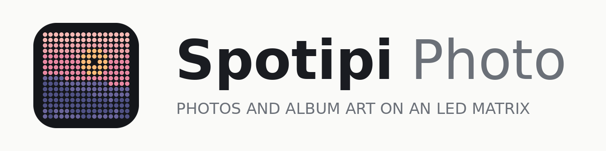

# spotipi-photo



Adds a **photo slideshow** to a Ryan Ward–style spotipi LED‑matrix build, with a rebuilt
**web control panel** (modes, live brightness, a *working* screen‑off timer, a daily
schedule and a sunrise/sunset dimmer). Album art takes over whenever Spotify is playing.

**Status:** v2.5 · **Stack:** Raspberry Pi · rpi-rgb-led-matrix · Python · Flask · osxphotos ·
Part of the [xpdr.aero](https://github.com/captaincomplex/captaincomplex.github.io) projects.
Shares a Pi happily with [Equalize](https://github.com/captaincomplex/equalize).

Photos get on in one of three ways: automatically from a named **Apple Photos** album on a Mac
(remove a photo from the album and it leaves the panel), automatically from an **iCloud Shared
Album** with no computer at all, or by hand from **any computer**, Windows included, with
`tools/prepare_photos.py` or the control panel's upload button.

```
Mac (Apple Photos album)              any computer (a folder of pictures)
   │  sync_album.py                      │  tools/prepare_photos.py
   │  crop/resize + rsync --delete       │  crop/resize + scp or rsync
   └──────────────┬──────────────────────┘
                  ▼
Raspberry Pi  ~/spotipi-photo/photos/
   │  displaySpotipi.py  — slideshow + Spotify priority, reads state.json live
   │  client/app.py      — web UI on :80, writes state.json
   ▼
RGB LED matrix — 64×64, 32×32 or 64×32
```

## Why this fixes the broken screen‑off timer
The original web app turned the panel on/off by `systemctl start/stop`‑ing the display
service and *restarted* it on every brightness change. That makes timers and brightness
fragile. Here the **display daemon is always running** and re‑reads `config/state.json` every
loop. The web UI only writes that file — no service juggling — so brightness is live and the
timer is enforced reliably by the daemon itself.

## Documentation

| Document | For |
|---|---|
| [`docs/USER_GUIDE.md`](docs/USER_GUIDE.md) | **Start here.** Setting up on current Raspberry Pi OS, step by step: the Spotify app (API key), the LED driver, installing, photos, updating, and rebuilding an older Spotipi. |
| [`docs/FAQ.md`](docs/FAQ.md) | Answers to common questions and fixes for common problems: missing album art, flicker, connecting, photos. |
| [`docs/guides/SPOTIPI_BEGINNERS_GUIDE.md`](docs/guides/SPOTIPI_BEGINNERS_GUIDE.md) | Someone building this from nothing, who has never used a Pi. Every command in full, plus troubleshooting. |
| [`docs/guides/spotipi_assembly_guide.pdf`](docs/guides/spotipi_assembly_guide.pdf) | The hardware, in 8 illustrated pages. Print it and put it next to the parts. Source: `assembly_guide_source.py`. |
| [`HARDWARE.md`](HARDWARE.md) | What to buy and why, with dated prices, the power budget, and the Pi-model reasoning. |
| [`SPOTIFY_TOKEN_RENEWAL.txt`](SPOTIFY_TOKEN_RENEWAL.txt) | Re-doing the Spotify login, roughly every 6 months. |
| [`image/make_logo.py`](image/make_logo.py) | Regenerates the logo, app icons and the panel splash from one geometry. |

The rest of this README is the quick version, for someone who already knows their
way around a Pi.

---

## Part A — Raspberry Pi

Written for **Raspberry Pi OS Lite (64-bit)** based on Debian 13 "trixie", the current
release. Older releases (Buster, Bullseye) are out of support and not tested.

1. Flash Raspberry Pi OS Lite (64-bit) with Raspberry Pi Imager, setting the hostname
   (e.g. `spotipi`), a username, Wi-Fi and SSH in its settings.
2. Install the LED driver with Adafruit's installer (`install_pi.sh` prints the exact
   commands if it's missing; the beginner's guide, Part 7, walks through them).
3. Copy the `spotipi-photo/` folder to the Pi as `~/spotipi-photo`, or clone it:
   ```bash
   git clone https://github.com/captaincomplex/spotipi-photo.git ~/spotipi-photo
   ```
4. Create a Spotify developer app at <https://developer.spotify.com/dashboard> with
   redirect URI `http://127.0.0.1/callback` (free, but since February 2026 its owner needs
   Spotify Premium), then do the one-off login:
   ```bash
   cd ~/spotipi-photo
   bash generate-token.sh        # writes .cache-<username>
   ```
   *(Reuse an existing `.cache-<username>` if you have one; copy it into this folder.)*
5. Install:
   ```bash
   sudo bash install_pi.sh
   ```
   It installs the Python libraries **from Raspberry Pi OS's own packages** (apt; `pip`
   into the system Python is refused on current releases), asks for your Spotify username /
   token path / client id+secret / redirect URI, sets `dtparam=audio=off` (the matrix needs
   it — the onboard audio and the panel share a timing circuit), and creates three services:
   - `spotipi` → `python/displaySpotipi.py`
   - `spotipi-client` → `python/client/app.py` (web UI, port 80)
   - `spotipi-icloud` → `python/icloudSync.py` (idle until you give it a shared-album link)
6. Open **http://spotipi.local** (or the Pi's IP address) in any browser on your network.

Set your panel details with `python3 tools/panel_setting.py rows=64 columns=64 ...` (kept in `config/rgb_options.local.ini`, which updates never touch) and `sudo systemctl restart spotipi`
after any change. **64×64, 32×32 and 64×32 panels are all supported** — set `rows` and
`columns` to match, and pass the same `--size` when you sync photos. `hardware_mapping`
stays `adafruit-hat` unless you have soldered the GPIO4→GPIO18 PWM jumper, in which case
use `adafruit-hat-pwm`. Raise `gpio_slowdown` if the panel tears.

**Sharing the Pi with Equalize.** Only one program can drive the LED panel at a time.
Install Spotipi Photo first, then Equalize; Equalize's installer notices and the two take
turns (by default Equalize while AirPlay music plays, Spotipi Photo otherwise). If
Equalize is already installed, this installer hands the choice to Equalize's switch.
The two control panels link to each other; brightness, quiet hours, the
dimmer and the timer are set separately in each, and Equalize's control panel lists any that
differ, with a button to copy these settings across. Set the panel's own settings once, here
(`tools/panel_setting.py`): Equalize uses them.

### Controls (web UI)
- **Now on the panel** — a live dashboard at the top: a snapshot preview of what's
  actually on the matrix right now, the current song/artist or photo, a daemon
  health dot, and stats (photo count, brightness, last sync, timer left, CPU temp,
  uptime). Refreshes every few seconds.
- **On (auto)** — Spotify art while music plays, photo slideshow otherwise.
- **Off** — blank panel (daemon keeps running).
- **Photos only** / **Spotify only** — force one source.
- **Brightness** — live slider, 1–100, no restart. (This is the *daytime* level when the
  sunrise/sunset dimmer is on.)
- **Photo slideshow** — seconds per photo, plus a **Change photo** button to skip to the next
  photo immediately.
- **Add photos** — upload from any browser; on an iPhone this opens the camera roll.
- **iCloud Shared Album** — paste a public shared-album link and the Pi mirrors it.
- **Screen timer** — turn the panel off after N minutes; the countdown restarts when you save
  it or tap a Display button.
- **Daily schedule** — recurring off window (handles overnight, e.g. 23:00→07:00).
- **Sunrise/sunset dimmer** — automatically drops to a lower night brightness between sunset
  and sunrise (times computed from your latitude/longitude — no internet or API key needed),
  and returns to the Brightness slider level during the day.

---

## Part B — getting photos on

### B1 — Apple Photos, automatic (requires a Mac)

The Pi can't read your Mac's Photos library, so a small job runs on the Mac.

1. In **Apple Photos**, create an album named exactly **`Spotipi`** and add photos to it.
2. Install deps, record your Pi's address, and set up SSH:
   ```bash
   cd spotipi-photo/mac
   bash install_mac.sh               # asks for your Pi's login, e.g. pi@spotipi.local
   ssh-copy-id pi@spotipi.local      # passwordless SSH for rsync
   ```
   Your Pi's address is saved in `mac/local.conf`, which is private (git-ignored).
   `install_mac.sh` also writes the two LaunchAgents with your paths filled in.
3. Test it:
   ```bash
   python3 sync_album.py --pi-host pi@spotipi.local --dry-run
   python3 sync_album.py --pi-host pi@spotipi.local
   ```
4. Automate every 5 minutes:
   ```bash
   launchctl load ~/Library/LaunchAgents/com.spotipi.albumsync.plist
   ```

`sync_album.py` options: `--album`, `--pi-host`, `--pi-dir`, `--size`, `--ssh-port`, `--dry-run`.
Use `--size 32` for a 32×32 panel.

### B2 — any computer, manual (Windows, macOS, Linux)

`tools/prepare_photos.py` centre-crops and resizes a folder of pictures to the panel size and
copies them over. This matters because the display daemon scales images down but never crops
them, so an uncropped 4:3 photo arrives letterboxed.

```bash
python3 tools/prepare_photos.py ~/Pictures/forpanel --push pi@spotipi.local
python3 tools/prepare_photos.py ~/Pictures/forpanel --size 32       # 32x32 panel
python3 tools/prepare_photos.py ~/Pictures/forpanel                 # prepare only, prints the scp command
```

Needs `pillow` (and `pillow-heif` for iPhone `.HEIC` files). On Windows, `scp` ships with
Windows 10 and 11; WinSCP works too — the destination is `~/spotipi-photo/photos/`.

### B3 — iPhone only, automatic

Make an iCloud Shared Album with **Public Website** on, and paste its link into the control
panel's **iCloud Shared Album** card. See the beginner's guide, Part 13.

### How deletion sync works
`sync_album.py` rebuilds the full album as 64×64 PNGs in a temp folder, then
`rsync -av --delete` mirrors it to the Pi's `photos/` folder. `--delete` removes any file on
the Pi that's no longer in the album. Photos still in iCloud and not downloaded locally are
skipped with a warning — open them once in Photos to download.

---

## Updates

The Pi updates itself from this project's **releases** on GitHub: numbered,
tested versions (v1.1.0), never whatever the code is that day.
`python/updater.py` checks every night between 04:00 and 05:00
(`spotipi-update.timer`). The control panel's **Updates** card shows this
Pi's version and the newest, with **Update now**, **Check now** and
**Install new releases automatically** (on unless you turn it off).

An update moves the program forward to that release and restarts it. It
never touches photos, settings, the Spotify token or the panel's own
settings. If any program file has been edited on the Pi it stops and says
which, rather than overwrite it. If the new version doesn't start
properly, the Pi goes back to the one before.

Set up by `install_pi.sh`, by Equalize's installer when the two share a Pi,
or on its own with `sudo bash tools/install_updater.sh`. Log:
`journalctl -u 'spotipi-update*'`.

**Releasing** (for whoever makes the change): merge to `main`, then tag that
commit with the next version and push the tag, e.g.
`git tag -a v1.1.0 -m "what changed" && git push origin v1.1.0`. Pis install
it that night. Nothing reaches them without a tag.

**The older Mac route** (`mac/auto_update.sh`, which copied a Dropbox zip to
the Pi) is replaced by this. If it is still set up on your Mac, turn it off,
as its copies would count as edits on the Pi:
`launchctl unload ~/Library/LaunchAgents/com.spotipi.autoupdate.plist`.
The files are kept in `mac/` for now.

## Publishing
`publish.sh` (on the Mac) copies this folder to a fresh clone of
`captaincomplex/spotipi-photo`, refuses to continue if any file contains your Mac username
or the Pi address from `mac/local.conf`, and pushes a branch for a pull request.

## Files
```
spotipi-photo/
├── install_pi.sh              # Pi installer (creates systemd services)
├── generate-token.sh          # one-off Spotify login -> .cache-<username>
├── publish.sh                 # Mac: push this folder to GitHub, with a privacy check
├── HARDWARE.md                # what to buy, and why
├── SPOTIFY_TOKEN_RENEWAL.txt  # how to refresh the Spotify token (~every 6 months)
├── README.md
├── config/
│   ├── rgb_options.ini        # matrix hardware defaults (64×64); yours go in rgb_options.local.ini
│   ├── state.json             # your settings, written by the web UI (not in git)
│   ├── default.png            # shown when nothing else to display
│   ├── spotipi.service        # display daemon unit
│   ├── spotipi-client.service # web UI unit
│   └── spotipi-icloud.service # iCloud Shared Album sync unit
├── python/
│   ├── displaySpotipi.py      # main display daemon
│   ├── display_logic.py       # pure mode/timer/schedule logic (tested)
│   ├── getSongInfo.py         # Spotify now-playing helper
│   ├── state.py               # atomic state.json read/write
│   ├── generateToken.py       # called by generate-token.sh
│   ├── icloudSync.py          # iCloud Shared Album daemon
│   ├── icloud_album.py        # iCloud Shared Album reader (tested)
│   └── client/
│       ├── app.py             # Flask web UI (port 80)
│       └── templates/index.html
├── photos/                    # the slideshow's pictures
├── mac/
│   ├── sync_album.py          # Apple Photos → Pi sync (Mac only)
│   ├── install_mac.sh         # sets up the sync; writes local.conf and the LaunchAgents
│   ├── auto_update.sh         # the older Mac update route (replaced by python/updater.py)
│   ├── com.spotipi.albumsync.plist    # LaunchAgent template
│   └── com.spotipi.autoupdate.plist   # LaunchAgent template
├── tools/
│   └── prepare_photos.py      # crop/resize + copy, any OS
├── image/
│   ├── make_logo.py           # regenerates everything below
│   ├── icon.svg, icon-*.png, favicon.ico
│   └── wordmark.png, wordmark-dark.png
├── docs/guides/
│   ├── SPOTIPI_BEGINNERS_GUIDE.md
│   ├── spotipi_assembly_guide.pdf
│   └── assembly_guide_source.py
└── tests/
    ├── test_logic.py
    └── test_icloud.py
```

## Licence

Free and open source under the [MIT licence](LICENSE). Spotipi Photo is built on
[Spotipi](https://github.com/ryanwa18/spotipi) by Ryan Ward (MIT, copyright 2020).
His copyright notice is kept in `LICENSE`, as that licence requires.

## Troubleshooting
- **Web UI loads but panel won't change** → `sudo systemctl status spotipi` and
  `journalctl -u spotipi -n 50`. Confirm the `rgbmatrix` driver is installed.
- **No Spotify art** → token/scope issue; the daemon falls back to `default.png`. Re‑run
  `generate-token.sh`. Needs scope `user-read-currently-playing`. Since February 2026 the
  Spotify app's owner also needs Premium.
- **Photos not updating** → on the Mac check `/tmp/spotipi-albumsync.log` and that
  `ssh pi@spotipi.local` works without a password.
- **Panel flickers** → `python3 tools/panel_setting.py gpio_slowdown=4`, restart spotipi.
- **Panel blank / `Permission denied: state.json` or `default.png`** → the LED
  library drops root to the `daemon` user unless told not to. `displaySpotipi.py` sets
  `options.drop_privileges = False` so the daemon stays root.
- **`externally-managed-environment` from pip** → you're following old instructions.
  Current Raspberry Pi OS installs Python libraries with apt; re-run `sudo bash install_pi.sh`.
- **Scheduled Mac sync finds 0 photos** → grant Full Disk Access to your
  python3 (add `/Library/Frameworks/Python.framework/Versions/<ver>/Resources/Python.app`
  via ⌘⇧G in the picker). Manual Terminal runs work without this.
